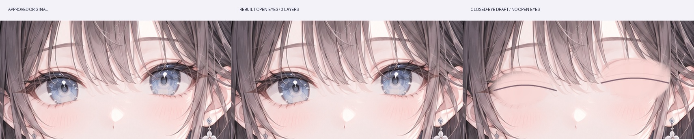
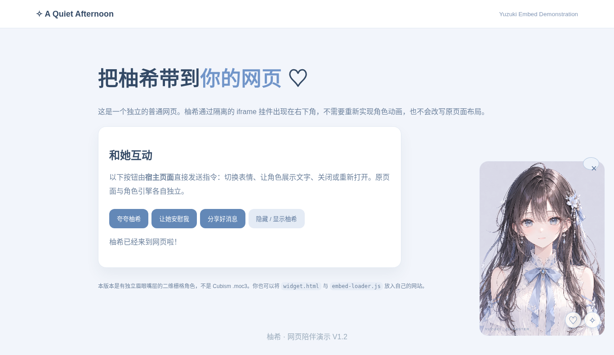
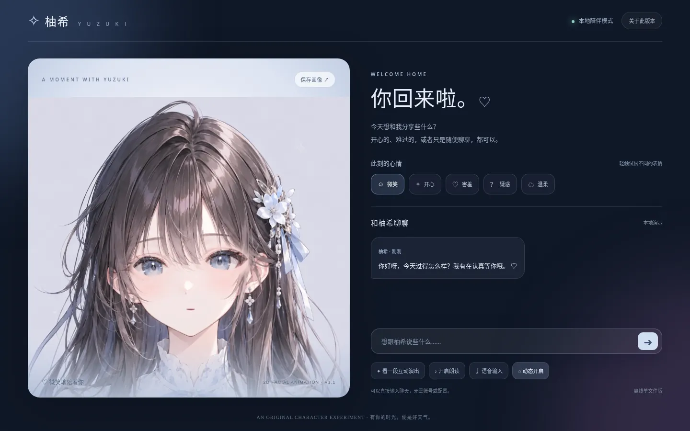

# V1.7：左右眼真正独立的 Cubism 美术准备稿（2026-10-09）

新增 `assets/cubism-handoff/yuzuki-eye-separated-v1.7.psd`：**左眼和右眼可见且独立，皮肤补画为底层**，闭眼关键形草稿独立隐藏。6 个实际 PSD 图层、1024×1536、合成睁眼完全保留经审核立绘的每个像素。可用 Krita/Photoshop 打开查看，详情和限制见 [`docs/22-actual-eyes-psd-v17.md`](docs/22-actual-eyes-psd-v17.md)。

这是一次真实的图层结构进展，但**仍不是独立上下眼皮/虹膜的专业重绘稿，也没有 Cubism 绑定工程 `.cmo3` 或 `.moc3`。**



---


## V1.6 Cubism 制作交接（2026-10-09）

这次补的是**可编辑 PSD 与 Cubism 出口质量检查**，不是声称模型已经绑定成功。

- `assets/cubism-handoff/yuzuki-cubism-art-handoff.psd`：真实 15 层 PSD，完整原画可见，实验眼部素材默认隐藏。
- `python tools/build_cubism_psd.py`：重建交接 PSD（完整包含 ORA 时生成 15 层，GitHub 克隆没有 ORA 时由 WebP 生成 14 层）。
- `python tools/check_cubism_export.py path/to/model.model3.json`：检查 Cubism 导出模型的文件引用。
- `docs/21-cubism-production.md`：实际补画与建模流程、阻塞清单和验收标准。

**注意：目前没有 `.cmo3`、`.moc3` 或完成绑定的模型。** 当前网页仍是栅格动画预览，不能当作专业 Live2D 成品。

# 柚希 Yuzuki V1.5 · 眼部自然度与重影修复（2026-10-09）

**本轮基于用户“机械抠眼和伪人感”的实际反馈继续修复视觉效果，而不是堆功能。** 21 组左右眼独立的眨眼关键帧替换原 9 组素材；使用原画与已修复的眼部底色差异提取实际遮挡范围，并填充瞳孔区域，减少半闭眼时旧睫毛与新眼线双层叠加以及完全闭眼时亮点残留。

- **原画绝对优先**：睁眼时眼部区域零重绘、与定稿原画 RGB 像素逐点一致。原画哈希不变。
- **渐进开合**：21 个眼睑样本，收敛上眼睑与下眼睑边缘；画布每个眼睛只绘制一帧，避免多重叠加造成鬼影。
- **实际测试**：70 项前端单元测试通过；Chromium 1440×900 与 390×844 测试正常；聊天与页面尺寸检查通过。
- **看效果**：[`V1.5 眼部逐帧对照`](assets/face-rig/qa-eyes-v15.jpg) · [`眨眼 GIF`](assets/face-rig/yuzuki-blink-v15.gif) · [`单文件可交互体验`](柚希-双击直接体验.html)。

**保留的限制**：眼皮依然是算法辅助绘制的栅格贴图而非真正的 Cubism 网格变形，近看或在极端表情下仍可能不如专业画师的手绘绑定。用户审核仍以最终浏览器观感为准，单元测试不能证明“足够好看”。

---

# 柚希 Yuzuki V1.4 · 眼部保真与眨眼质量修复（2026-10-09）

**本版优先处理“机械抠眼、大小眼、伪人感”反馈，不重复确认主视觉。** 不再从原画挖空眼睛。静止睁眼直接绘制审核过的完整原画；眨眼使用左右独立的 18 张透明眼睑过渡素材（网页压缩为 1 张图集）。常驻眼神保持稳定，暂缓可能破坏眼缘的 iris 平移。


**立即体验**：双击 [`柚希-双击直接体验.html`](柚希-双击直接体验.html)；网页挂件用 [`柚希-悬浮挂件.html`](柚希-悬浮挂件.html)，也有 [`柚希-网页嵌入演示.html`](柚希-网页嵌入演示.html)。无需配置 API 即可体验静态原画、眨眼、基础聊天。

**质量验证**：66 项前端测试；1440×900 和 390×844 浏览器检查通过，正常睁眼眼部 ROI 与原画 RGB 逐像素完全一致；网页挂件桌面和移动端功能检查通过。详细见 [V1.4 技术说明](docs/20-eye-fidelity-v14.md)。

**边界**：半闭眼过渡仍需美术精修；不是 Cubism Live2D 模型，没有真正的眼球转向或骨骼/网格绑定。

---

# 柚希 Yuzuki V1.2 · 网页悬浮挂件（2026-10-09）

**不用安装软件，直接双击 `柚希-网页嵌入演示.html` 就能看到柚希出现在一个普通网页里。** 同时交付 `柚希-悬浮挂件.html`，可以单独作为小角色窗展示。

新增：零依赖网页 iframe 挂件、宿主 `say/emotion/gaze/motion/ping` 控制协议、自动缩放、隐藏与唤回、真实 Chromium 桌面/手机交互验收。将 `web/` 放入其他项目即可复用，方法见 [`docs/19-web-widget-v12.md`](docs/19-web-widget-v12.md)。



**诚实边界：仍是有独立眼口眉图层的 2D 栅格动画，不是 Cubism `.moc3` Live2D 专业模型。** 官方网格绑定仍需重绘补层和手工调整。

---

# 柚希 · Yuzuki | V1.1 可直接体验的陪伴原型（2026-10-09）

> **现在优先体验**：[免安装单文件 `柚希-双击直接体验.html`](柚希-双击直接体验.html)；Windows 安装 Python 3 后也可双击 `一键体验柚希.cmd` 运行本地服务（支持选配 AI 模型）。



### V1.1 的真实改进

- 修复了 **V1.0 单文件打包脚本导致浏览器报 `Unexpected token export`、动画无法启动** 的问题；新增解析校验避免回归。
- **真实 Chromium 端到端测试**：在 1440×900、1366×768、390×844 三个视口测试分层画布、表情、聊天、关于对话框和水平溢出，并测试 PNG 图片下载。
- 聊天时按情绪执行 0.2–0.4 秒的短表情过渡（如“惊讶→害羞”），不再机械立即切换；关闭动画时不延时。
- 新增**保存当前角色图片**，以及自愿开启的本机浏览器聊天历史记录（默认关闭，最多 30 条，可清空）；连接 AI 时对话会发送至用户配置的模型服务。
- [真实浏览器视频](柚希-v1.1-实际浏览器演示.mp4) 与 [测试截图](assets/qa-v11/yuzuki-v11-desktop.webp) 都来自实际浏览器渲染，不是静态合成示意。

**技术边界**：仍属于分层栅格二维人物动画，不是专业 Live2D Cubism `.moc3` 模型；没有真正的 3D 头部转动或精细音素级口型。浏览器自动化使用内联 HTML 注入验证，当前执行环境禁止直接导航到本地 URL，因此“用户双击打开文件”仍需个人电脑复核。

源码与验证见 [V1.1 说明](docs/18-v11-delivery-and-tests.md)。

---

# 柚希 · Yuzuki | V1.0 可体验陪伴版

**优先体验成品**：Windows 安装 Python 3 后，双击 `一键体验柚希.cmd`，自动打开全新的 `web/companion.html`。无需模型密钥即可试表情、聊天和互动演出；也可以选择接入 OpenAI 兼容接口进行真正的 AI 对话。


> **技术边界**：目前是具备独立眉眼嘴的二维栅格动画，不是 Cubism `moc3`。艺术审核通过的柚希主视觉不做改变。

查看 [V1.0 使用说明和真实 AI 接入方法](docs/17-companion-release-v10.md)，工程化参数调试页仍在 `web/index.html`。

---

# 柚希 · Yuzuki V0.9 — 柔和闭眼、自然表情过渡与视线待机

> 目标：创造一位**可爱、温柔陪伴、清冷知性、灵动、略带梦幻感**的日系精致动画风虚拟角色，让美术、表情、声音与对话成为一体，并可复用于网页、桌面与其他应用。


## 主视觉已锁定：先做成品，再审核

- **已选定**：中间图「银花晨光」（`front-a`），使用用户上传原图核对 SHA-256 完全一致：`5ecb00c0b580ede77d9629d37925cb6dce7d394888d83bd121b3ee6cfbd8f478`。
- **默认展示**：`web/index.html` 永远使用这张图，不受旧浏览器评分缓存影响。
- **无须反复确认**：已定稿的审美不再设为生产前置条件；`web/review.html` 仅在主动提出修改时使用。
- **后续重点**：先完成可复用、可测试的真实渲染与美术资产，再把成果交由用户审核。
- **事实边界**：本版本已有独立眼睛、虹膜、睫毛、眉毛和嘴部的试验透明图层，以及可在 Krita/GIMP 编辑的 `.ora` 工程；仍不是经过画师精修的分层 PSD 或 Cubism 绑定模型。

## V0.9 已完成（2026-10-09）

- **闭眼线稿重绘**：两套新的透明闭眼线和两套淡化眼褶独立图层，更自然的闭眼/单眼 Wink，不更换定稿角色的脸。
- **14 层 OpenRaster**：`assets/face-rig/yuzuki-facial-prototype-v09.ora`，可在 Krita/GIMP 中修改；仍不是可直接导入 Cubism 的正式分层 PSD。
- **动作变化更柔和**：微笑、腮红、眼睛和眉毛有不同平滑时间，视线有停顿、可跟随鼠标并回归自然待机，情绪倾身不再骤然跳动。
- **实际离线对照**：[V0.8 与 V0.9 闭眼对比](assets/face-rig/qa-closed-before-after-v09.jpg) · [八种眼睛状态](assets/face-rig/qa-soft-lids-v09.jpg) · [眼睑短动画](assets/face-rig/yuzuki-lid-v09.gif)。这些不是浏览器录屏。
- **复现与限制**：见 [`docs/16-soft-lids-and-motion-v09.md`](docs/16-soft-lids-and-motion-v09.md)。

## V0.8 实际新增（2026-10-09）

- **不再挤扁虹膜眨眼**：眼球与睫毛保持原比例，使用双侧眼角收拢的贝塞尔曲线眼睑遮罩逐步遮盖眼睛。
- **新增睫毛前景图层**：在原有分层基础上单独提取左右睫毛；现在共有 **12 层可编辑 OpenRaster**，不是正式 Cubism 模型。
- **眼睑连续试镜**：网页「动作参数」中新增开合 0–100% 滑条，一眼即可看出哪些闭合阶段需要美术修复。
- **极轻微二维倾身**：让情绪姿态真正影响视觉展示；这**不是**头部 XY 转向。
- **可直接看效果**：[八种眼睑状态检查](assets/face-rig/qa-aperture-v08.jpg)、[动态 GIF](assets/face-rig/yuzuki-lid-v08.gif)，均是 **Pillow 离线生成**而非浏览器实拍。
- 重建步骤、技术边界和后续精修清单：[`docs/15-eyelid-occlusion-v08.md`](docs/15-eyelid-occlusion-v08.md)。

## V0.7 实际新增（2026-10-09）

**核心升级：眼睛不再整块跟着视线位移。** 新增左右虹膜、眼白/固定眼线、左右眉毛独立纹理，允许极小幅注视与眉毛情绪动作。保留原有脸部、眨眼、单眼 Wink、5 种嘴型、麦克风功能，发布 10 层 OpenRaster 试验素材。

- 查看 [六种虹膜/眉毛状态对照](assets/face-rig/qa-eye-detail-v07.jpg) 与 [虹膜注视短动画](assets/face-rig/yuzuki-iris-gaze-v07.gif)。这两者是离线素材合成，不是实时浏览器录像。
- 在网页「动作参数」点击“看向左边 / 看向右边 / 恢复视线”，也可在角色区域内移动鼠标。
- 要重建素材，查看 [V0.7 图层生产与局限](docs/14-iris-eyebrows-v07.md)，执行 `tools/build_eye_detail_v07.py`。
- **限制**：由于刘海挡住部分眉毛，现阶段自动分层并非最终画师级 PSD，尚未完成 Cubism 导入；全页面 Chromium 自动测试受到环境阻止。

## V0.6 实际新增（2026-10-09）

- **每只眼单独控制**：眨眼加入微小错峰，可独立进行左眼 / 右眼 Wink，闭合与恢复用独立缓动曲线。
- **新绘制闭眼线素材**：新增 `eye_left_closed.webp`、`eye_right_closed.webp`，闭眼时淡入独立透明贴图，替代原来的运行时矢量眼线；调节曲线避免形成勾状眼角。
- **情绪与眼睛联动**：微笑时眯眼、疑惑时双眼产生轻微不对称、惊讶放大睁眼程度；仍属二维参数化模拟。
- **减少原画撕裂**：原先鼠标移动会推动整块眼睛数个像素，现在限制为小于 1 像素。
- **可编辑六层 OpenRaster**：`assets/face-rig/yuzuki-facial-prototype-v06.ora`，包含自动修复底图、原画左右眼、嘴和两幅新增闭眼线。它是栅格试验分层，不是正式 PSD。
- **有图可验**：`assets/face-rig/qa-face-states-v06.jpg`（八种状态）和 `assets/face-rig/yuzuki-eyes-wink-v06.gif`（左右眨眼短动画），均为离线 Pillow 合成模拟，不是浏览器实拍。
- **32 项单元测试通过**，运行 `cd web && npm test && npm run check`，再从根目录运行 `python tools/validate_release.py`。

体验方式：Windows 解压后双击 `一键体验柚希.cmd`，进入「动作参数」点击**左眼 Wink**或**右眼 Wink**。下一步主要瓶颈仍是未独立绘制的眉毛、虹膜和额发遮挡，距离 Cubism 绑定还有美术工序。

详情见 [`docs/13-eye-rig-v06.md`](docs/13-eye-rig-v06.md)。

## V0.5 已完成的升级（2026-10-09）

- **自然眨眼**：变成不规则间隔、快闭慢开；眼睑使用局部线条模拟。
- **多种基础口型**：A / I / U / E / O 目标形状；网页提供 A/I/O 手动试镜。
- **真实声音的嘴部响应**：授权麦克风后，本地计算音频响度控制嘴型，不上传数据；退出或停止立即释放麦克风。
- **轻微视线跟随**：鼠标移动时对眼睛局部做小幅度响应。
- **情绪脸部合成**：腮红、笑意及睁眼程度随参数变化，支持导出当前 Canvas 为 PNG。
- **可重现的视觉检查**：`assets/face-rig/qa-face-states-v05.jpg` 和 `yuzuki-face-motion-v05.gif`；它们是离线 PIL 模拟合成，不冒充浏览器截图。
- **测试**：运行 `cd web && npm test && npm run check`，再在根目录运行 `python tools/validate_release.py`。

Windows 下双击 `一键体验柚希.cmd`，进入网页点击「动作参数」查看新按钮。新增功能和限制详见 [`docs/11-voice-and-face-v05.md`](docs/11-voice-and-face-v05.md)。

**技术边界：**这还不是通过专业面部精修与 Cubism 绑定的 Live2D 成品。浏览器 TTS 口型来自文本节奏估计，麦克风驱动来自真实音量，两者都还不是音素识别。网页自动 UI 截图在当前执行环境不稳定，因此发布前仍需用户做一次浏览器体验验收。

## V0.4 基础成果（保留）


**Windows 双击 `一键体验柚希.cmd`**（需系统 Python 3），进入页面后切换「动作参数」并点击「眨眼一次」「张嘴一下」。不想运行任何程序也可以直接打开 `assets/face-rig/yuzuki-face-motion-preview.gif` 观看实际分层合成的离线短动画。

如需修改眼、嘴位置和遮罩，完整 ZIP 中可直接用 Krita 或 GIMP 打开 `assets/face-rig/yuzuki-facial-prototype.ora`。GitHub 代码分支含一键再生成它的脚本（`pip install -r tools/requirements.txt` 后运行 `python tools/build_face_rig.py`），详情见 `docs/10-real-facial-layers.md`。

## 可选：需要修改时才使用美术审核台

**不需要再次选图。** 默认访问 `web/index.html` 查看柚希；如果日后想调整，再打开 `web/review.html` 比较三套美术方案，给「脸、眼、角色辨识度、发型、服装、绑定友好度」六项打分，点击「认可这个方向 / 需要修改」，最后导出 JSON 发回给我，后续我按你的审核意见迭代。整个过程无需你写代码。

另有 `web/index.html` 用于网页交互实验，加入三段情绪试镜（被夸、安慰、分享喜悦）。

**已知限制**：自动浏览器 GUI 导航在当前环境被管理员策略拦截（ERR_BLOCKED_BY_ADMINISTRATOR），使用离线逐帧合成进行视觉质量检查，并通过单元测试。请在自己的浏览器最终体验；独立栅格图层动画仍不是 Cubism Live2D 的网格变形。

## 当前交付与尚未完成的部分

| 交付 | 状态 | 说明 |
|---|---|---|
| 三张角色稿（中间图已定稿） | ✅ 概念稿 | 一张初版主视觉 + 两张近正面美术候选，供审核定稿 |
| 角色设定板 | ✅ 概念稿 | 表情、三视图、服装、分层意向图。**其中 PSD 和目录截图只是绘制示意** |
| 16 种表情参考 | ✅ 静态素材 | 从概念板裁切，仅作为美术与情绪参考，不是独立可变形图层 |
| 网页交互实验室 | ✅ 代码完成 | 两眼/嘴分层、口型 A/I/U/E/O、麦克风响度驱动、文本节奏估计、16 态参数和情绪演出（浏览器图形验收待复核） |
| OpenRaster 透明分层 | ✅ 试验可编辑 | 完整 ZIP 中 `assets/face-rig/yuzuki-facial-prototype-v08.ora` V0.8 共有 12 层：修复底图、左右眉、左右虹膜、左右眼白、嘴部和两条闭眼线。GitHub 端通过 `tools/build_face_rig.py` → `tools/build_eyelid_layers.py` → `tools/build_eye_detail_v07.py` → `tools/build_eye_lashes_v08.py` 重建。**不是正式高精 PSD。** |
| 离线动画预览 | ✅ 已生成 | `assets/face-rig/yuzuki-face-motion-preview.gif`，可无需运行服务查看 |
| **美术审核台** | ✅ 代码完成 | 三套候选、并排对比、6 项打分、浏览器本地保存、导出 JSON |
| 行为引擎 | ✅ 原型 | 与渲染器分离的情绪→参数映射，包含单元测试 |
| 正式分层 PSD | ⏳ 待精修 | 现已有 12 层 ORA 试验稿，尚需手工补绘眉眼口及头发遮挡、独立睫毛/虹膜等部件 |
| Cubism 源模型 `.cmo3` | ⏳ 待绑定 | 无法用一张图片自动替代建模工作 |
| 可运行 Live2D `.moc3` / `.model3.json` | ⏳ 待导出 | 需要 Cubism Editor 导出并检查物理、表情、动作 |
| 真正的 AI 对话 / 实时语音 | ⏳ 待接入 | 当前是本地关键词应答，浏览器 TTS 与有条件语音输入 |

**不要将本项目当前的网页演示称作“已完成的 Live2D 模型”。** 这是一套有明确升级路径的视觉与交互原型。

## 直接体验（已选立绘，不必重新审核）

**Windows 用户：直接双击 `一键体验柚希.cmd`。** 会自动选择本机空闲端口并打开浏览器（需系统已安装 Python 3）；关闭命令窗口即停止预览。

也可以执行 `python run_yuzuki.py --check` 校验素材是否完整。

## 手动测试（零 npm 依赖）

1. 下载项目，进入 `web` 文件夹。
2. 推荐在这个目录启动静态服务器：

   ```bash
   # Windows（已安装 Python）
   py -m http.server 5173
   # macOS / Linux
   python3 -m http.server 5173
   ```

3. 在浏览器打开 `http://localhost:5173/index.html`，直接查看已选中的柚希、情绪演出、模拟聊天与语音朗读。只有要修改立绘时才去 `review.html`。
4. 不需要任何 API Key，也不需要上传个人数据。演示没有自建后端。

或者试着双击 `web/index.html`，但建议使用本地服务器以避免部分浏览器的 ES Modules `file://` 限制。

**检查代码与测试：**

```bash
cd web
node --check js/app.js
node --check js/character-engine.js
node --test js/character-engine.test.mjs
```

建议 Node 20+。正式部署可以把 `web/` 原样发布到静态站点。

## 目录

```text
yuzuki-live2d/
├── README.md
├── art-direction.lock.json       # 已批准的中间立绘，不再重复确认
├── 一键体验柚希.cmd / run_yuzuki.py # 自动在本机打开预览
├── LICENSE-CODE.md
├── assets/
│   ├── source/                  # 生成的高清原始概念图（不可视为 PSD）
│   ├── face-rig/                 # 可编辑 12 层 OpenRaster / 视觉 QA / GIF
│   └── psd-workspace/           # 图层交付结构说明与验收表
├── docs/
│   ├── 01-character-bible.md    # 人设、五官、发型、服装、配色
│   ├── 02-art-production.md     # 美术绘制与 PSD 图层规范
│   ├── 03-expression-rig.md     # 表情、Cubism 参数、动作设计
│   ├── 04-architecture.md      # 网页/桌面/AI/语音集成
│   ├── 05-quality-gates.md     # 审美与绑定验收标准
│   ├── 06-roadmap.md           # 实施路线、风险与手工环节
│   ├── 07-art-review-v02.md    # 三套立绘、审核与冻结规则
│   ├── 08-rig-production-handoff.md # PSD 与 Cubism 交接标准
│   ├── 09-production-decision.md # 不反复确认决策
│   └── 10-real-facial-layers.md # V0.4 眼嘴图层及质量边界
└── web/
    ├── review.html              # 美术审核台（本次优先使用）
    ├── review.css
    ├── index.html
    ├── style.css
    ├── js/
    │   ├── review.js / review-data.js    # 审核表单与 JSON 导出
    │   ├── story-director.js   # 三组连续情绪演出
    │   ├── character-engine.js # 纯粹的行为参数模型
    │   ├── app.js              # UI/语音/模拟对话
    │   ├── raster-face-rig.js / raster-face-rig.test.mjs
│   └── character-engine.test.mjs
    └── assets/                 # 压缩后的主视觉/设定板/表情参考
```

## 完整 Live2D 落地方式

1. 主形象已经确定为 front-a，中间那张，不再重复确认。
2. 将概念绘画**重新整理成真正多图层文件**，按 `docs/02-art-production.md` 重绘并补全脸、眼、口、发等各层隐藏区域。
3. 在 Live2D Cubism Editor 中导入规范 PSD，制作 ArtMesh / Warp Deformer，先完成头部 XY、嘴型、左右眨眼、眉毛，再加物理与表情。
4. 导出可运行 `.model3.json`、`.moc3`、纹理、动作与表情；用官方 Cubism SDK for Web 构建渲染器适配模块，把 `CharacterEngine` 的参数翻译为 Cubism 参数 ID。
5. 完成美术、运动与聊天联动验收，之后才进行桌面端封装。

请从 [Cubism 官方 Web SDK](https://docs.live2d.com/en/cubism-sdk-manual/cubism-sdk-for-web/) 获取授权软件包。**本仓库不包含 Live2D Cubism Core，也不会自行上传官方受限二进制。**

## 核心设计原则

- **美术优先**：好看的静态角色是底线；静态不足，动起来无法补救。
- **可爱是底色**：温柔与知性决定常驻神态，灵动由行为呈现，梦幻感点到为止。
- **表情是参数，不是贴纸**：眼、眉、嘴、视线、腮红、头部运动可组合，并有时间演出。
- **行为与渲染分离**：让同一套情绪行为被网页、桌面或游戏中的不同角色渲染器复用。
- **不伪装**：概念稿不是分层 PSD；模拟聊天不是大模型；动画占位不是 Live2D 绑定。

## 权利与使用说明

代码以 `LICENSE-CODE.md` 为准。角色图像为本项目生成的原创方向概念稿，后续对外公开、商用、二次创作或委托画师重画前，请审查所用生成服务条款、人物相似性风险及委托合同的权利归属。`Live2D`、`Cubism` 为各自权利人商标，不属于本项目，使用官方 SDK 与样例模型须遵守其各自许可条款。
